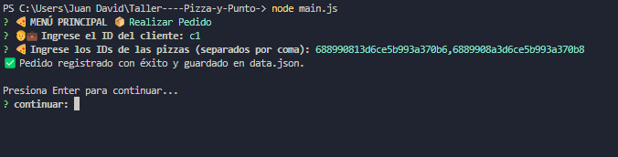

# 🍕 Pizza y Punto – Sistema de Pedidos e Inventario

Este proyecto simula el sistema de gestión para la pizzería **"Pizza y Punto"**, permitiendo registrar pedidos, controlar inventario, asignar repartidores y generar reportes de ventas con MongoDB y Node.js.

---

## 📦 Tecnologías utilizadas

- Node.js (v22+)
- MongoDB (local o Atlas)
- Inquirer (menús interactivos en consola)
- MongoDB Driver para Node.js (`mongodb`)

---

## 📁 Estructura del proyecto

```
.
├── data/                      # Carpeta con documentos de ejemplo (JSON)
├── colecciones.js            # Validaciones $jsonSchema de las colecciones
├── pedido.js                 # Lógica para realizar pedidos con transacciones
├── consultas.js              # Reportes con Aggregation Framework
├── main.js                   # Menú principal interactivo
├── package.json              # Dependencias del proyecto
└── README.md                 # Este archivo
```

---

## ⚙️ Instalación y ejecución

1. Clona el repositorio o descarga los archivos:

```bash
git clone https://github.com/tu_usuario/pizza-y-punto.git
cd pizza-y-punto
```

2. Instala las dependencias:

```bash
npm install inquirer mongodb
```

3. Asegúrate de tener tu base de datos MongoDB lista (local o Atlas) y que el URI esté directamente en los archivos como se configuró.

4. Ejecuta el menú:

```bash
node main.js
```

---

## 🍕 Funcionalidades

### ✅ Módulo de pedidos

- Toma el ID del cliente y pizzas seleccionadas.
- Verifica disponibilidad de ingredientes.
- Descuenta ingredientes del inventario.
- Asigna automáticamente un repartidor disponible.
- Calcula el total y registra el pedido con fecha y estado.
- Todo en una **transacción MongoDB segura**.

---

## 📝 Consideraciones para la Creación de Pedidos

### 👤 Clientes Disponibles

Solo puedes usar clientes existentes registrados en la base de datos. Estos son:

| ID Cliente | Nombre       | Teléfono     | Dirección         |
|------------|--------------|--------------|-------------------|
| c1         | Juan Pérez   | 31301234567  | Calle 123         |
| c2         | Laura Gómez  | 31312345678  | Carrera 45        |
| c3         | Carlos Díaz  | 3132456789   | Av. Siempre Viva  |
| c4         | Ana Torres   | 3134567890   | Transversal 10    |

### 🍕 Pizzas Disponibles

Solo puedes usar las siguientes pizzas disponibles actualmente:

| ID Pizza                       | Nombre       | Categoría   | Precio |
|--------------------------------|--------------|-------------|--------|
| 688990783d6ce5b993a370b4       | Hawaiana     | especial    | 22000  |
| 688990813d6ce5b993a370b6       | Vegetariana  | vegana      | 20000  |
| 6889908a3d6ce5b993a370b8       | Mixta        | tradicional | 27000  |
| 688990923d6ce5b993a370ba       | Margarita    | tradicional | 18000  |

Ejemplo de pedido válido:

```json
{
  "cliente": "c1",
  "pizzas": [
    "6889908a3d6ce5b993a370b8",
    "688990813d6ce5b993a370b6"
  ]
}
```
### ejemplo de la consola con foto de como hacer pedido:



### 🛵 Disponibilidad de Repartidores

- El sistema cuenta con 4 domiciliarios disponibles, con estado inicial `true`.
- Cada vez que se registra un pedido, se asigna automáticamente un repartidor disponible.
- Después de 4 pedidos, no se podrán registrar más hasta que los repartidores estén disponibles nuevamente.

---

## 📦 Colecciones utilizadas

```js
ingredientes
{
  nombre: String,
  tipo: String,
  stock: Number
}

pizzas
{
  nombre: String,
  categoria: String,
  precio: Number,
  ingredientes: [{ nombre: String, cantidad: Number }]
}

clientes
{
  nombre: String,
  telefono: String,
  direccion: String
}

repartidores
{
  nombre: String,
  zona: String,
  estado: String // "disponible" o "ocupado"
}

pedidos
{
  cliente_id: ObjectId,
  pizzas: [{ pizza_id: ObjectId, nombre: String }],
  total: Number,
  repartidor_id: ObjectId,
  fecha: Date,
  estado: String
}
```

---

## 👨‍💻 Autor

Desarrollado por **Jean Marlon Barajas, Juandavid Bermeo Castro, Santiago Pedraza** como parte del taller de MongoDB y Node.js – Julio 2025.
